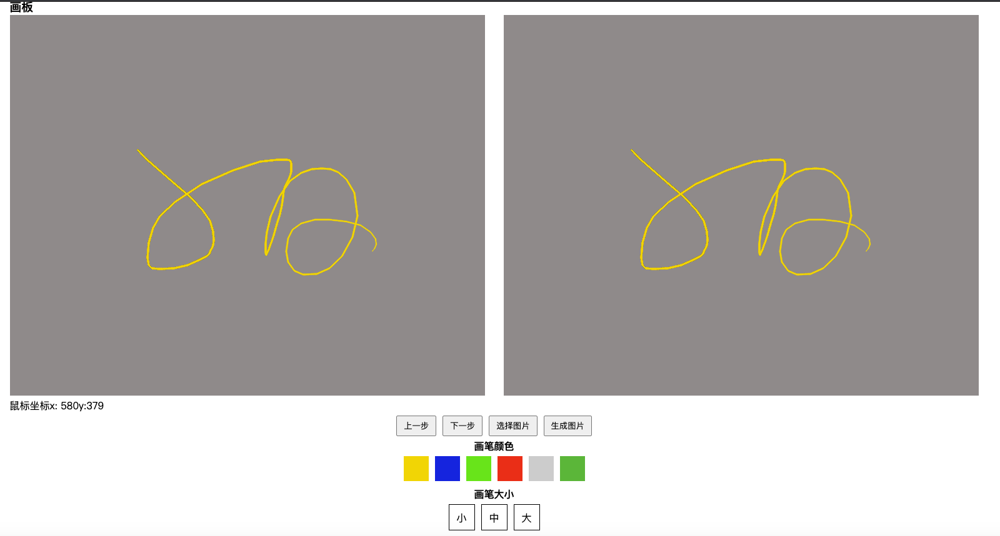

# canvas-palette

## 简述 
这个项目主要是VUE版本的涂鸦板，目前只支持在PC使用，
支持添加背景图片，支持修改画笔大小颜色等常用的功能，因为一开始就考虑是
做涂鸦的功能，所以暂时不考虑添加图片拖拽，缩放等功能

## 已完成的功能
-[x] 涂鸦
-[x] 修改画笔颜色
-[x] 修改画笔大小
-[x] 上一步功能
-[x] 下一步功能
-[x] 切换背景图片
-[x] 生成图片

## 预览


## 安装
```
yarn install
```
### 开发预览
```
yarn dev
```
